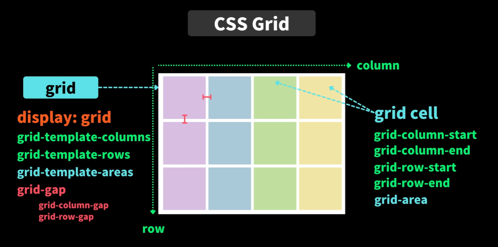
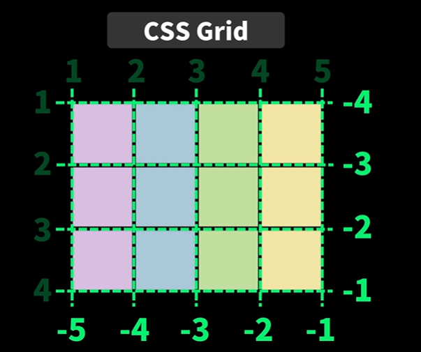

# HTML & CSS

## CSS

### Grid

- display : grid
- grid-template-columns 
- grid-template-rows
- grid-auto-rows
- grid-gap
- grid-column-gap
- grid-row-gap

- grid-column-start
- grid-column-end
- gird-row-start
- grid-row-end

축약 

- grid-column : 1 / 4
- grid-row : 2 / 4